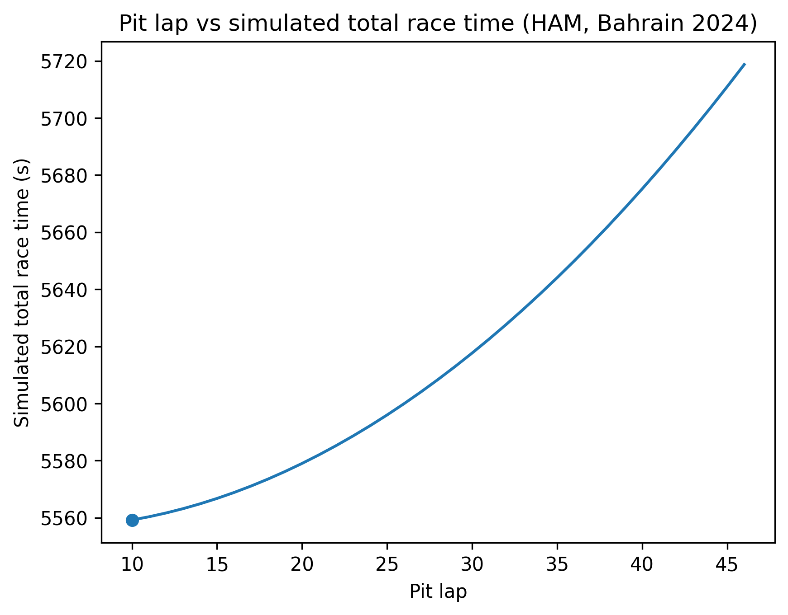

# F1 Pit Strategy Simulator

A data analytics project that uses Formula 1 race data to model tire degradation and simulate optimal pit stop timing.

The script analyzes lap-by-lap data, estimates how tire performance declines, and runs counterfactual simulations to find pit laps that minimize total race time.

---

## What the Project Does

- Loads race data using FastF1
- Cleans lap data and removes pit/outlier laps
- Estimates tire degradation per stint
- Builds compound-level pace and degradation models
- Simulates one-stop pit strategies
- Identifies optimal pit stop windows
- Plots pit lap vs simulated total race time

---

## Example Output



---

## Tech Stack

Python, Pandas, NumPy, FastF1, Matplotlib

---

## How to Run

Install dependencies:

```bash
pip install -r requirements.txt
